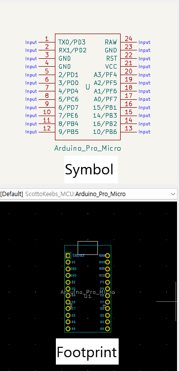

# Full-Custom-Keyboard

##### 목표: 아두이노 프로 마이크로 또는 rp2040-zero 보드를 사용하여 스플릿 키보드 제작

###### 저는 전자 비전공자이고, 전기 전자 아무것도 몰라도 무리없이 키보드 제작이 가능했습니다. 이 글은 구글링해서 얻은 자료들을 제작 순서에 맞게 짜깁기 한 내용에 불과합니다.

  

## 순서:

1. #### 레이아웃 설계

2. #### 회로도 설계

3. #### pcb 설계

4. #### pcb, 부품 주문

5. #### 납땜, qmk 펌웨어 플래시

6. #### 완성

  

1. ## 레이아웃 설계

#### 키보드 레이아웃 == 키보드 배열

##### 보통 키보드 레이아웃은 키보드 배열을 말하는데, 어떤 배열의 키보드를 만들지 정해야 회로도나 pcb를 설계할 때 고민할 일이 없으니 만들어 놓고 시작하는 것이 좋습니다. 키보드 레이아웃은 [keyboard-layout-editor](http://www.keyboard-layout-editor.com/) 에서 만들 수 있습니다. GitHub 계정이 있다면 만든 레이아웃을 저장할 수도 있습니다. JSON 파일로 저장해도 됩니다.

##### 저는 위 배열로 만들겠습니다. fn키를 누르면 나오는 키는 qmk 펌웨어를 사용해서 원하는 대로 어떤 것이든 지정할 수 있으니 나중에 편한대로 커스텀 해도 됩니다.

   

2. ## 회로도 설계

##### 회로도와 PCB는 [KiCad](https://www.kicad.org/) 라는 프로그램을 사용해서 설계할 것입니다. 버전은 7.0 이상의 stable 버전을 기준으로 설명하겠습니다.

 

### 회로도 설계전에 알아야 할 내용

#### [키보드 매트릭스 원리 이해하기](https://m.blog.naver.com/kdahaam/221495967863)에 잘 정리되어 있습니다.

##### 

##### 적게는 40키, 많게는 100키가 넘어가는 키보드의 모든 스위치를 하나하나 컨트롤러에 연결하기에 컨트롤러의 핀 개수가 모자르게 됩니다.  때문에 행과 열로 스위치를 묶어서 연결하고 각 행과 열을 컨트롤러에 연결하면 훨씬 적은 핀으로 다수의 스위치를 인식할 수 있게 됩니다.  이렇게 되면 스위치를 하나만 눌렀을 때는 잘 작동하지만 여러 스위치를 동시에 눌렀을 때 눌리지 않은 키까지 인식하는 경우가 생깁니다. 이럴 때 사용하는 것이 `다이오드` 입니다.   다이오드는 전기를 한 방향으로만 흐르게 만드는 데, 이게 누르지 않은 스위치가 눌리는 현상을 막아줍니다. 잘 이해가 안된다면 `스위치 하나당 다이오드 하나가 필요하다` 정도로 생각하면 되겠습니다. 저는 46개의 스위치를 사용하기 때문에 다이오드 46개가 필요하겠네요.

  

### 회로도를 설계전에 필요한 파일 설치

#### KiCad를 실행합니다.

##### `Ctrl + n` 또는 New Project를 눌러 새로운 프로젝트를 생성합니다. 프로젝트를 생성했을 때 `프로젝트이름.kicad_pcb`와 `프로젝트이름.kicad_sch`파일을 확인하면 됩니다.

#### Footprint와 Symbol 라이브러리 다운로드

##### Symbol은 우리가 키보드에 사용할 부품의 회로도 그림이고, Footprint는 pcb 설계할 때 사용할 부품의 실제 그림이라고 생각하면 되겠습니다. 우리가 사용할 부품을 잘 정리해놓은 [scottoKicad](https://github.com/joe-scotto/scottokeebs/tree/main/Extras/ScottoKicad)가 있습니다. [DownGit](https://minhaskamal.github.io/DownGit/#/home?url=https://github.com/joe-scotto/scottokeebs/tree/main/Extras/ScottoKicad)사이트에서 바로 다운로드 할 수 있습니다. 라이브러리 적용 방법은 [KiCad 라이브러리 적용방법](https://github.com/Jangmyun/Full-Custom-Keyboard/tree/main/kicadLibrary)에 정리해두었습니다.

  

### 본격적으로 회로도를 그려봅시다.

##### 프로젝트 폴더를 열고 `kicad_sch`파일을 열어줍니다.

##### 단축키 `A`를 눌러 스위치와 다이오드 심볼을 추가해주겠습니다. `scottokeebs`로 검색하면 앞서 적용한 심볼 라이브러리를 찾을 수 있습니다.

##### 추가한 스위치와 다이오드를 옮겨서 위와같이 만들어줍니다. 스위치와 다이오드 하나가 세트입니다. 이제 앞에서 만든 레이아웃대로 스위치와 다이오드를 배치하겠습니다. 스위치와 다이오드를 드래그하고 복사하면 됩니다. 일정한 간격으로 배치해야 와이어를 연결할 때 편리합니다.

##### 어지럽긴 하지만 이런식으로 배치가 됩니다. 저는 스플릿 키보드라서 좌,우 각각 떨어뜨려놨습니다.  이제 단축키 `W`로 각 행과 열을 연결해주겠습니다.

##### 이런 구조가 되는데, 연결할 때 검은색 원 안의 초록색 점은 서로 연결되었다는 뜻입니다. 연결되지 않은 선 끼리는 빨간색 원처럼 아무것도 표시되지 않습니다. 와이어 교차할 때 주의해야 합니다.

##### 다음은 각 행과 열에 라벨을 붙여줘야 합니다. 같은 이름의 라벨은 PCB 설계 단계에서 서로 연결됩니다. `Ctrl + L`또는 회로도 편집기 우측의 `Global Label`을 선택하고 이름을 정해주면 됩니다.

##### 라벨을 보기쉽게 만드려고 회로도를 조금 수정했습니다. 저는 스플릿 키보드를 만들거라 왼쪽 오른쪽의 라벨 이름을 구분해줬습니다. 보통 행열 라벨은 `col`과 `row`로 작명합니다.

##### 이제 MCU를 회로도에 추가합니다. 스플릿 키보드라서 두개 추가해줍니다. 저는 rp2040-zero를 사용하겠습니다. 단축키 `A`를 누르고 rp2040-zero를 추가합니다.

##### 총 23개의 핀이 있는데 그중에서 `3V3`,`GND`,`5V`외에는 자유롭게 행열을 연결할 수 있습니다. 다만 스플릿 키보드를 만들 때는 좌우 컨트롤러의 시리얼 통신을 위해 `GPIO0`, `GPIO1` 핀을 비워주겠습니다.

##### 연결을 완료했습니다. PCB 설계과정에서 다시 돌아와 수정할 수 있으니 연결되는 위치는 크게 중요하지 않습니다.

### [좌우 컨트롤러의 통신 방법 (스플릿 키보드만 해당)](https://docs.qmk.fm/#/serial_driver?id=usart-full-duplex)

##### MCU의 통신방법은 여러가지가 있는데 우리는 시리얼 통신, 그중에서도 `USART Full-Duplex` 방식을 사용하겠습니다. 이름부터 어려워보이는데 그냥 선 네 개만 잘 연결하면 됩니다. 좌우의 연결은 3.5mm 이어폰 잭 (TRRS)로 할겁니다. 따라서 3.5mm 이어폰 커넥터를 추가하겠습니다. `Placeholder_TRRS`로 검색해서 두 개 추가해줍니다.

##### USART Full-Duplex 방식은 TX를 RX에, RX를 TX에 연결해야 합니다. 저는 간단히 TRRS 커넥터의 TX와 RX를 좌우가 엇갈리도록 하겠습니다. 빨간 박스처럼 하면 됩니다.
