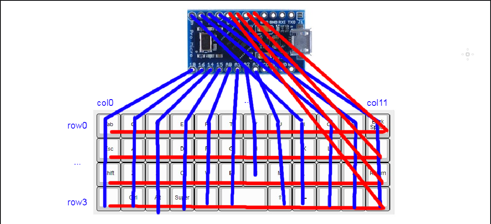
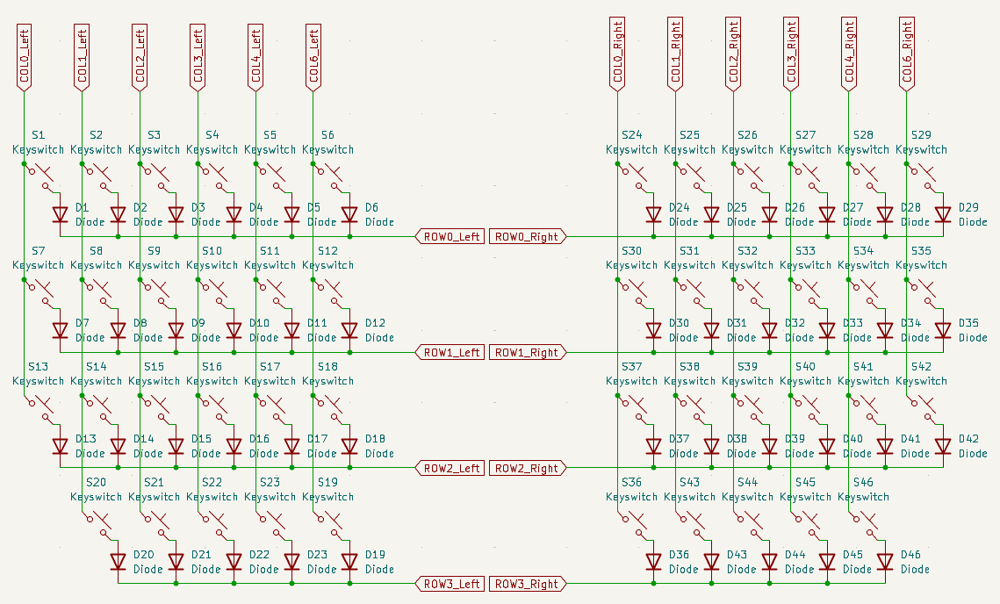
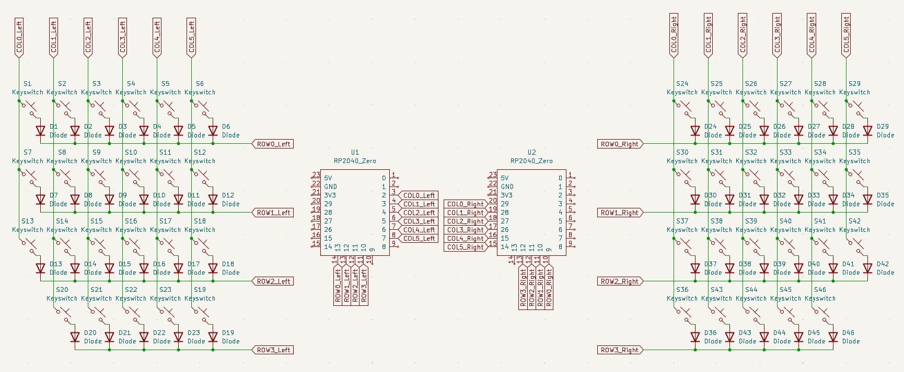
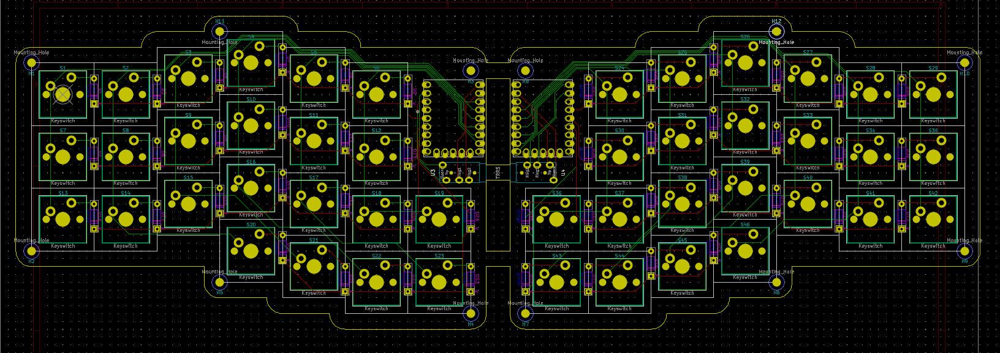

# Full-Custom-Keyboard

##### 목표: 아두이노 프로 마이크로 또는 rp2040-zero 보드를 사용하여 스플릿 키보드 제작

###### 저는 전자 비전공자이고, 전기 전자 아무것도 몰라도 무리없이 키보드 제작이 가능했습니다. 이 글은 구글링해서 얻은 자료들을 제작 순서에 맞게 짜깁기 한 내용에 불과합니다.

  

## 순서:

1. #### 레이아웃 설계

2. #### 회로도 설계

3. #### pcb 설계

4. #### 보강판, 상판 설계

5. #### pcb, 부품 주문

6. #### 납땜, qmk 펌웨어 플래시

7. #### 완성

  

1. ## 레이아웃 설계

#### 키보드 레이아웃 == 키보드 배열

##### 보통 키보드 레이아웃은 키보드 배열을 말하는데, 어떤 배열의 키보드를 만들지 정해야 회로도나 pcb를 설계할 때 고민할 일이 없으니 만들어 놓고 시작하는 것이 좋습니다. 키보드 레이아웃은 [keyboard-layout-editor](http://www.keyboard-layout-editor.com/) 에서 만들 수 있습니다. GitHub 계정이 있다면 만든 레이아웃을 저장할 수도 있습니다. JSON 파일로 저장해도 됩니다.

##### 저는 위 배열로 만들겠습니다. fn키를 누르면 나오는 키는 qmk 펌웨어를 사용해서 원하는 대로 어떤 것이든 지정할 수 있으니 나중에 편한대로 커스텀 해도 됩니다.

   

2. ## 회로도 설계

##### 회로도와 PCB는 [KiCad](https://www.kicad.org/) 라는 프로그램을 사용해서 설계할 것입니다. 버전은 7.0 이상의 stable 버전을 기준으로 설명하겠습니다.

 

### 회로도 설계전에 알아야 할 내용

#### [키보드 매트릭스 원리 이해하기](https://m.blog.naver.com/kdahaam/221495967863)에 잘 정리되어 있습니다.

##### 

##### 적게는 40키, 많게는 100키가 넘어가는 키보드의 모든 스위치를 하나하나 컨트롤러에 연결하기에 컨트롤러의 핀 개수가 모자르게 됩니다.  때문에 행과 열로 스위치를 묶어서 연결하고 각 행과 열을 컨트롤러에 연결하면 훨씬 적은 핀으로 다수의 스위치를 인식할 수 있게 됩니다.  이렇게 되면 스위치를 하나만 눌렀을 때는 잘 작동하지만 여러 스위치를 동시에 눌렀을 때 눌리지 않은 키까지 인식하는 경우가 생깁니다. 이럴 때 사용하는 것이 `다이오드` 입니다.   다이오드는 전기를 한 방향으로만 흐르게 만드는 데, 이게 누르지 않은 스위치가 눌리는 현상을 막아줍니다. 잘 이해가 안된다면 `스위치 하나당 다이오드 하나가 필요하다` 정도로 생각하면 되겠습니다. 저는 46개의 스위치를 사용하기 때문에 다이오드 46개가 필요하겠네요.

  

### 회로도를 설계전에 필요한 파일 설치

#### KiCad를 실행합니다.

##### `Ctrl + n` 또는 New Project를 눌러 새로운 프로젝트를 생성합니다. 프로젝트를 생성했을 때 `프로젝트이름.kicad_pcb`와 `프로젝트이름.kicad_sch`파일을 확인하면 됩니다.

#### Footprint와 Symbol 라이브러리 다운로드

##### Symbol은 우리가 키보드에 사용할 부품의 회로도 그림이고, Footprint는 pcb 설계할 때 사용할 부품의 실제 그림이라고 생각하면 되겠습니다. 우리가 사용할 부품을 잘 정리해놓은 [scottoKicad](https://github.com/joe-scotto/scottokeebs/tree/main/Extras/ScottoKicad)가 있습니다. [DownGit](https://minhaskamal.github.io/DownGit/#/home?url=https://github.com/joe-scotto/scottokeebs/tree/main/Extras/ScottoKicad)사이트에서 바로 다운로드 할 수 있습니다. 라이브러리 적용 방법은 [KiCad 라이브러리 적용방법](https://github.com/Jangmyun/Full-Custom-Keyboard/tree/main/kicadLibrary)에 정리해두었습니다.

  

### 본격적으로 회로도를 그려봅시다.

##### 프로젝트 폴더를 열고 `kicad_sch`파일을 열어줍니다.

  

##### 단축키 `A`를 눌러 스위치와 다이오드 심볼을 추가해주겠습니다. `scottokeebs`로 검색하면 앞서 적용한 심볼 라이브러리를 찾을 수 있습니다.

##### 추가한 스위치와 다이오드를 옮겨서 위와같이 만들어줍니다. 스위치와 다이오드 하나가 세트입니다. 이제 앞에서 만든 레이아웃대로 스위치와 다이오드를 배치하겠습니다. 스위치와 다이오드를 드래그하고 복사하면 됩니다. 일정한 간격으로 배치해야 와이어를 연결할 때 편리합니다.

##### 어지럽긴 하지만 이런식으로 배치가 됩니다. 저는 스플릿 키보드라서 좌,우 각각 떨어뜨려놨습니다.  이제 단축키 `W`로 각 행과 열을 연결해주겠습니다.

##### 이런 구조가 되는데, 연결할 때 검은색 원 안의 초록색 점은 서로 연결되었다는 뜻입니다. 연결되지 않은 선 끼리는 빨간색 원처럼 아무것도 표시되지 않습니다. 와이어 교차할 때 주의해야 합니다.

##### 다음은 각 행과 열에 라벨을 붙여줘야 합니다. 같은 이름의 라벨은 PCB 설계 단계에서 서로 연결됩니다. `Ctrl + L`또는 회로도 편집기 우측의 `Global Label`을 선택하고 이름을 정해주면 됩니다.

##### 라벨을 보기쉽게 만드려고 회로도를 조금 수정했습니다. 저는 스플릿 키보드를 만들거라 왼쪽 오른쪽의 라벨 이름을 구분해줬습니다. 보통 행열 라벨은 `col`과 `row`로 작명합니다.

##### 이제 MCU를 회로도에 추가합니다. 스플릿 키보드라서 두개 추가해줍니다. 저는 rp2040-zero를 사용하겠습니다. 단축키 `A`를 누르고 rp2040-zero를 추가합니다.

##### 총 23개의 핀이 있는데 그중에서 `3V3`,`GND`,`5V`외에는 자유롭게 행열을 연결할 수 있습니다. 다만 스플릿 키보드를 만들 때는 좌우 컨트롤러의 시리얼 통신을 위해 `GPIO0`, `GPIO1` 핀을 비워주겠습니다.

##### 연결을 완료했습니다. PCB 설계과정에서 다시 돌아와 수정할 수 있으니 연결되는 위치는 크게 중요하지 않습니다.

### [좌우 컨트롤러의 통신 방법 (스플릿 키보드만 해당)](https://docs.qmk.fm/#/serial_driver?id=usart-full-duplex)

##### MCU의 통신방법은 여러가지가 있는데 우리는 시리얼 통신, 그중에서도 `USART Full-Duplex` 방식을 사용하겠습니다. 이름부터 어려워보이는데 그냥 선 네 개만 잘 연결하면 됩니다. 좌우의 연결은 3.5mm 이어폰 잭 (TRRS)로 할겁니다. 따라서 TRRS 커넥터를 추가하겠습니다. `Placeholder_TRRS`로 검색해서 두 개 추가해줍니다.

##### USART Full-Duplex 방식은 TX를 RX에, RX를 TX에 연결해야 합니다. 저는 간단히 TRRS 커넥터의 TX와 RX를 좌우가 엇갈리도록 하겠습니다. 빨간 박스처럼 하면 됩니다.

##### 이제 회로도는 완성됐습니다. PCB파일로 넘어가기 전에 회로도에 들어간 부품들의 실제 Footprint를 지정해줘야 합니다.

##### 에디터 상단의 Footprint Assignment Tool을 열어줍니다.

##### 같은 종류의 부품을 `shift + 마우스클릭`으로 선택해주고 라이브러리에서 부품에 맞는 풋프린트를 더블클릭해주면 적용됩니다. 각 심볼에 맞는 풋프린트의 라이브러리와 이름은 다음과 같습니다.

| 심볼          | 라이브러리                  | 풋프린트 이름      |
| ----------- | ---------------------- | ------------ |
| Diode       | ScottoKeebs_Components | Diode_D0-35  |
| Keyswitch   | ScottoKeebs_MX         | MX_PCB_1.00u |
| RP2040_Zero | ScottoKeebs_MCU        | RP2040_Zero  |
| TRRS        | ScottoKeebs_Components | TRRS_PJ-320A |

##### 만약 다른 사이즈의 키캡을 사용한다면 각 사이즈에 맞는 MX스위치 풋프린트를 사용하면 됩니다. 여기까지 하면 회로도는 완성입니다. 이제 PCB 디자인으로 넘어가겠습니다.

  

3. ## PCB 설계

##### 열려있는 회로도 에디터에서 PCB 에디터를 바로 열어줍니다.

  
  

##### 회로도 에디터의 수정사항들을 PCB에 반영합니다.

##### 이제 어지럽게 얽힌 풋프린트들이 에디터에 생깁니다. 서로 연결된 선끼리 이어주면 됩니다. 그 전에 만들고자 하는 키보드의 레이아웃에 맞게 스위치와 다이오드를 정렬해줘야 합니다.

##### 스위치 하나의 가로세로 길이는 `19.05mm`입니다. pcb에디터의 격자 사이즈를 19.05mm를 4로 나눈 `4.7625mm`로 설정하고 진행하겠습니다.

  
  

##### User Grid에서 `4.7625mm`로 그리드를 설정해줍니다. 이제 모든 스위치를 예쁘게 정렬하면 됩니다.

##### 기존의 스위치 번호에 유의해서 배치해주면 됩니다. 위치를 중구난방으로 해도 되기는 하는데 나중에 지옥이 펼쳐지니 순서대로 해주세요.

#### 꿀팁:

  
  

##### 회로도, pcb에디터 각각 상단의 버튼을 눌러 왔다갔다 할 수 있습니다. 이게 왜 좋냐면 회로도 에디터에서 심볼을 선택하면 PCB 에디터에서도 선택된 상태가 됩니다.  또 스위치 정렬이 잘 안될 때가 있는데 스위치를 드래그할 때 스위치의 중심부를 잡고 이동하셔야 스위치간 간격이 정확히 맞습니다.

##### 단축키 `S`를 눌러 가장 좌측 상단의 스위치의 좌상단 꼭짓점을 격자의 기준으로 지정합니다.

##### 스위치 정렬이 끝났습니다. 이제 다이오드를 스위치 사이에 끼워넣기 하겠습니다.

##### 다이오드는 PCB 기판의 하단에 넣을겁니다. 다이오드를 전부 선택하고 단축키 `F`를 눌러 뒤집어줍니다. 이제 스위치 사이사이에 다이오드를 배치해줍니다.

##### 스위치의 1/4 지점에 배치해줍니다. 개인적으로 이렇게 배치하는게 행열 연결할 때 깔끔하게 할 수 있어서 좋았습니다.

##### 다이오드 정렬이 끝났습니다. 이제 rp2040-zero와 trrs 커넥터를 배치하고 회로도에 맞춰 선을 연결해주겠습니다. 단축키 `X`키로 배선을 시작할 수 있습니다. 배선작업을 하기 전에 미리 볼트가 들어갈 구멍을 뚫고 시작해도 됩니다.

#### [KiCAD 사용법 강좌-배선/Copper/비아뚫기 - YouTube](https://youtu.be/5w91CukhzNU?si=pJJ6Ocjb_U-1WQmc)

##### 위 영상에서는 배선 굵기를 조절하는데, 우리는 스위치가 눌린 것만 인식하면 되는 키보드라 따로 조절할 필요는 없습니다. `F.Cu`와 `B.Cu`를 단축키 `V`로 바꿔가면서 배선을 할 수 있습니다.

##### 빨간색이 `F.Cu`고 초록색이 `B.Cu`입니다. 두 선은 각각 앞면, 뒷면의 배선이기 때문에 겹쳐도 합선되지 않습니다. 적절히 섞어가면서 배선작업을 해주면 됩니다.

##### 배선이 완료되었습니다. 저는 여기서 기판을 고정할 볼트가 들어갈 구멍을 뚫어주겠습니다. 다시 회로도 에디터로 돌아갑니다.

##### `Placeeholder_Mounting_Hole`로 검색하고 추가해줍니다. Footprint Assignment Tool을 열어 `MountingHole` 라이브러리의 `MountingHole_2.2mm_M2`를 선택해줍니다. M2 사이즈의 볼트를 사용할겁니다.

##### 다시 PCB 에디터로 돌아와 회로도의 변경사항을 업데이트해줍니다.

##### 나사 체결 홀이 생겼습니다. 이제 이걸 적절한 위치에 배치해주겠습니다.

##### 배치가 완료됐습니다.

#### 이제 기판의 가장자리 커팅라인을 그려줘야 합니다.

##### `Edge.Cuts`를 선택해주고 직선과 호를 그려 PCB의 모양을 잡아주겠습니다.

##### 이런 모양이 됩니다. 왼쪽 오른쪽 따로 만들어도 되는데 주문시 가격이 더 올라가기 때문에 통째로 만들어서 잘라서 사용하는 방식으로 하겠습니다.

#### Design Rules Checker로 잘못된 부분이 있는지 확인해보겠습니다.

##### `Run DRC`버튼을 눌러 확인합니다. `Warnings`에 12개가 나오지만 일단 `Errors`를 중점적으로 체크해주면 됩니다.

##### `Warning`은 대부분 실크스크린(PCB위에 실제로 그려지는 부분)이 잘리면서 생기는 것이 대부분입니다. 크게 신경쓰지 않아도 작동에 이상이 없습니다.

#### 이제 PCB의 나머지 부분을 구리로 채워주겠습니다.

  
  

##### 단축키`Ctrl + Shift + Z`나 `Add filled Zone` 버튼을 누르고 에디터의 빈 공간을 클릭해줍니다. 레이어를 두개 다 체크 해주고 OK버튼을 누릅니다.

##### PCB 전체를 감싸주고 단축키 `B`키를 눌러 채워줍니다. PCB 디자인의 모든 과정이 끝났습니다. 이제 이 파일을 거버 `.gbr` 파일로 저장해야합니다.

#### [How to generate Gerber and Drill files in KiCad 7](https://jlcpcb.com/help/article/362-how-to-generate-gerber-and-drill-files-in-kicad-7)

##### 위 링크는 우리가 PCB를 주문할 업체인 JLCPCB의 설명문입니다. 그대로 따라해서 거버파일을 한 폴더에 저장하면 됩니다.

###### 수정사항:

###### pcb의 전체적인 디자인과 홀 위치를 수정했습니다.

  

4. ## 보강판, 하판 설계

##### 이제 보강판, 하판 설계를 해야합니다. 저는 Fusion360 무료버전을 사용해서 만들었습니다. 이 부분은 설명하기가 너무 어려워서 잘 만들어진 유튜브 강좌로 대체하겠습니다. 진짜 너무 어려워서 설계하기가 힘들다 하시는 분들은 스위치를 고를 때 5핀 스위치를 선택하시고 하판은 최소구매 수량때문에 남는 PCB를 하판으로 이용하면 됩니다.  근데 이러면 키보드가 정말 기괴해지니까 저는 보강판을 설계하겠습니다.

[메이커를 위한 Fusion 360 모델링 - YouTube](https://youtube.com/playlist?list=PLovJKdHnVxzlUSWneVlyuwuWpvtWabgab&si=KHW3WNaJRUbpsRhU)

##### 약 2시간 반 정도 강의 따라가면 `.dxf` 형식의 평면 도면 정도는 쉽게 만들 수 있습니다.

  

##### mx 스위치 상판에는 스위치를 끼울 구멍을 내야하는데, `14mm`로 만들면 됩니다. 저도 아직 툴 사용이 미숙해서 Fusion360 단축키 `D`를 사용해서 길이 노가다를 해줬습니다.

[CherryMX.pdf - Google Drive](https://drive.google.com/file/d/1mCyr-2AKkUAvFVv7urUcg1ZXiUHRZjrM/view)

##### 위 링크는 체리MX 스위치의 상세 스펙입니다. 인치로 표기되어있습니다..

  
  

##### 보강판과 하판을 만들어주었습니다. 일단 보강판을 만들면 하판은 거기서 조금만 수정하면 됩니다.

  

##### 실제로 체결하게 되면 이렇게 됩니다.

[How to save or export a Sketch as DXF in Fusion 360](https://www.autodesk.com/support/technical/article/caas/sfdcarticles/sfdcarticles/How-to-Save-Sketch-as-DXF-in-Fusion-360.html)

##### 만든 도면을 DXF 파일로 저장해줍니다.

  

5. ## PCB, 부품 주문

##### 이제 PCB와 보강판 설계가 완료됐으니 주문을 해야합니다.

#### PCB:

##### PCB의 경우 [JLCPCB](https://jlcpcb.com/)에서 주문할 수 있습니다.

##### 사이트 회원가입/로그인 후 `Order now`를 누르고 미리 만들어둔 Gerber 파일이 든 폴더를 zip파일로 압축해서 업로드합니다.

##### 파일이 정상이라면 다음처럼 Gerber viewer가 표시됩니다. 주문서 아래를 보면 옵션이 매우매우 많은데 우리가 볼 것은 `PCB Color`와 `Surface Finish`뿐입니다. PCB의 색깔은 개인취향에 따라 선택하면 되고 표면마감의 경우 `HASL`과 `ENIG` 방식이 있습니다. 간단히 말하면 `HASL`가 더 싸고, `ENIG`가 마감은 더 좋지만 비쌉니다. 저는 저렴한 HASL로 결정했습니다. 결제는 해외결제 카드나 페이팔을 이용하면 됩니다. 아마 처음 회원가입 시 주는 쿠폰이 있을텐데 최대한 이용하는 걸 추천합니다.

#####  

#### 보강판:

##### 보강판, 하판은 아크릴로 만들건데, [아트릴](http://www.artryl.com/)이라는 곳을 이용하겠습니다. `제작문의 > 글쓰기`에서 만든 DXF파일을 업로드해주고 원하는 아크릴 색상과 두께를 적어주면 됩니다. 저는 상판, 하판 모두 `2t (2mm)`로 했습니다.

 

#### 나머지 부품들:

##### [rp2040-zero](https://ko.aliexpress.com/item/1005004281549886.html?spm=a2g0o.productlist.main.1.354e62cbC70N9T&algo_pvid=626a833b-b21b-42ce-b56c-c0ea334f0c61&algo_exp_id=626a833b-b21b-42ce-b56c-c0ea334f0c61-0&pdp_npi=4%40dis%21USD%212.29%211.92%21%21%212.29%21%21%402101fb1717018272371176484eafc5%2112000028615122543%21sea%21KR%21736615590%21&curPageLogUid=QE96GyUpw6MU)

##### [Male-Female/M2x3 & Female-Female/M2x3](https://ko.aliexpress.com/item/1005004564012666.html?spm=a2g0o.cart.0.0.5fbb56baDkGYG4&mp=1&gatewayAdapt=glo2kor)

##### [M2/4mm](https://ko.aliexpress.com/item/1005005070119421.html?spm=a2g0o.cart.0.0.5fbb56baDkGYG4&mp=1&gatewayAdapt=glo2kor)

 

##### 제작에 필요한 부품을 모두 구매했습니다. 이제 도착할 때까지 기다리면 됩니다..
