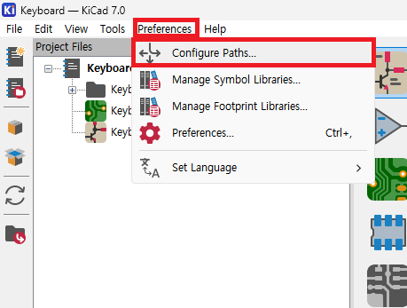
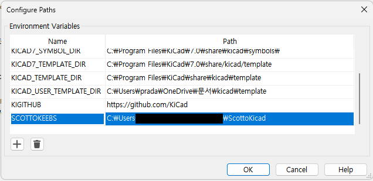
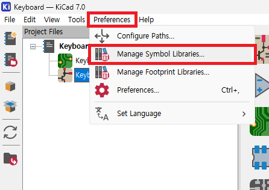
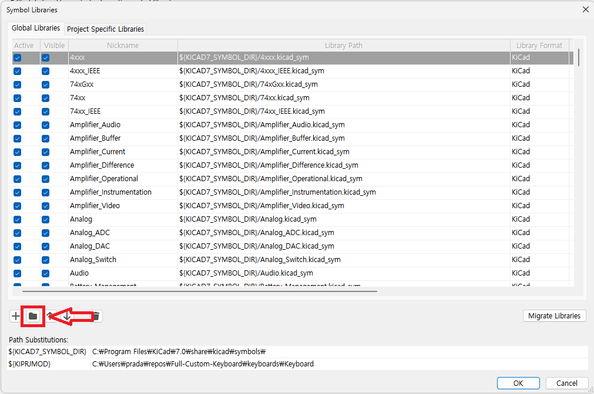
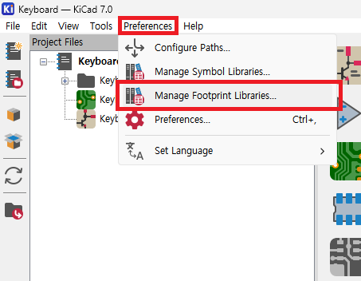
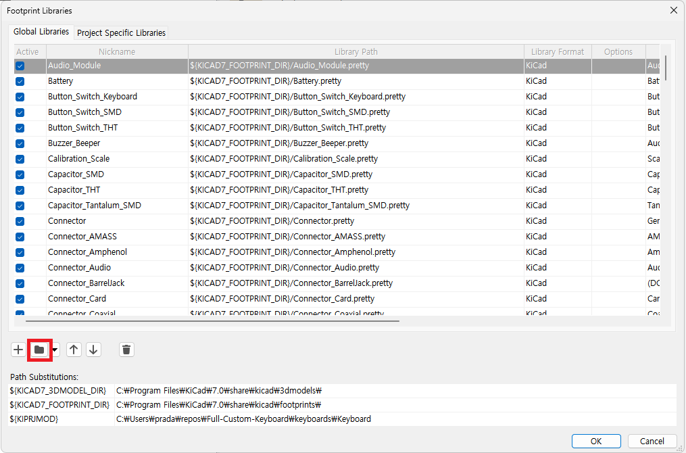
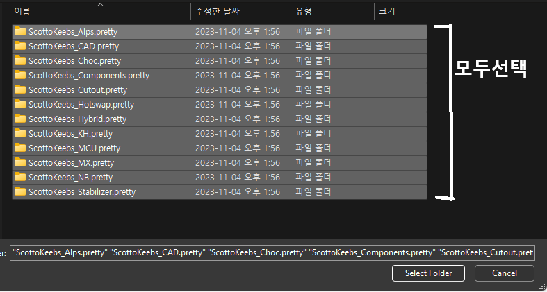

# KiCad 라이브러리 적용 방법

##### 파일을 다운받았다면 압축을 풀어줍니다.

<figure class="half">
    
    
</figure>

##### `Preferences > Configure Paths` 로 들어가서 압축을 푼 파일을 선택해줍니다. 이름은 아무렇게나 지어도 됩니다.

<figure class="half">
    
    
</figure>

##### `Preferences > Manage Symbol Libraries` 로 들어가서 압축을 푼 파일 내부의 `.kicad_sym` 확장자를 선택하고 추가해줍니다.

<figure class="third">
    
    
      
</figure>

##### `Preferences > Manage Footprint Libraries` 로 들어가서 압축을 푼 파일의 Footprint 폴더 안에 있는 모든 폴더를 선택해줍니다.
